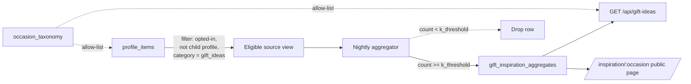

# KAN-178 / KAN-179 — Occasion-based Gift Inspiration (Design Proposal)

**Status:** Draft for review
**Owner:** Luisa (product) / engineering TBD
**Tickets:** [KAN-178](https://checklyra.atlassian.net/browse/KAN-178), [KAN-179](https://checklyra.atlassian.net/browse/KAN-179)
**Type:** Discovery + design — no code, no migrations in this PR
**Note on filename:** KAN-178 specifies `docs/INVESTIGATIONS/gift-inspiration-feature.md`; this doc lives at `docs/proposals/…` to match the new convention. Re-home if we prefer the original path.

---

## 1. Problem statement

A meaningful share of Lyra users are **gifters**, not giftees. The "I want to get my son's teacher something thoughtful and they're never going to make a Lyra profile" case is real and recurring. Today Lyra solves *recipient on Lyra → gifter sees their preferences* beautifully, and offers nothing for *recipient not on Lyra → gifter wants inspiration*. That gap currently routes through Google + listicle blogs of dubious quality.

Two opportunities arrive together:

1. **Direct user value** — "Popular on Lyra for Teacher end-of-year" gives a gifter somewhere honest and calm to land when the recipient isn't profilable.
2. **Acquisition loop** — public, indexable inspiration pages are a credible SEO surface for queries like "40th birthday gift ideas UK".

The "sell aggregate insights to brands" variant was rejected on brand and legal grounds upstream of this doc. Per both tickets, this feature is **occasion-based, not person-based**: "Popular on Lyra for Teacher end-of-year" is on-brand; "Teachers aged 30–40 in the South East like X" is the same data, off-brand, out of scope. v1 exposes one axis — occasion — and no demographics in the UI ever.

### Grounding in the current Lyra model

Key finding from reading the schema: **`profile_items` does not yet have an `occasion` column**. Items are typed by `item_category` (`gift_ideas`, `gifts_to_avoid`, `likes`, `dislikes`, `helpful_to_know`, `boundaries`, plus the eight categories added in `20260330080000_add_missing_item_categories.sql`) but there is no per-item occasion tag. The whole feature presumes occasion-tagged items; the data model has to acquire that capability before there is anything to aggregate. Two viable approaches:

- **(a) `occasion` column on `profile_items`** — nullable, allow-listed; minimum effort.
- **(b) `item_occasions` junction table** — supports multiple occasions per item; more flexible long-term.

This proposal assumes one of them lands in Phase 1.

## 2. Data model sketch

### 2.1 Source-side: occasion tagging

```text
profile_items.occasion text              -- nullable, allow-listed
-- OR (preferred for v2 flexibility):
item_occasions(id, profile_item_id, occasion)

occasion_taxonomy(slug pk, display_name, is_active, created_at)
```

Server-side validation: every write references an active `occasion_taxonomy.slug`. **No free-text** — also kills cohort-narrowing attacks (KAN-178 §4).

### 2.2 Aggregate-side: precomputed inspiration table

```text
gift_inspiration_aggregates
  id            bigint pk
  occasion      text not null          -- fk to occasion_taxonomy.slug
  item_category item_category          -- restricted at write time (see below)
  item_label    text not null          -- canonicalised item title
  count         integer not null       -- >= k_threshold
  cohort_size   integer not null       -- eligible cohort for this occasion
  last_updated  timestamptz not null
  unique (occasion, item_category, item_label)
```

**Key invariant — enforced at write time, not read time:** a row is only upserted if `count >= k_threshold`. Rows that fall below threshold on the next refresh are **deleted**, not zeroed, so a shrinking cohort (e.g. via opt-outs) reverts to editorial fallback automatically.

**Restricted categories.** Only `item_category = 'gift_ideas'` is eligible. `boundaries`, `dislikes`, `helpful_to_know`, `gifts_to_avoid` are excluded — aggregating those is hostile ("people on Lyra commonly avoid X" is gossip, not inspiration). Hard rule, not a config flag.

**Canonicalisation.** `item_label` is not the raw `profile_items.title`. It is the result of a normalisation pass (lower-case, strip punctuation, optionally a small LLM/embedding clustering step to collapse "scented candle" + "Yankee candle" + "candle (scented)" into one label). Without canonicalisation every item is a singleton and k-threshold is never met. Detailed rules ticketed separately.

**No demographic axes in v1.** No `age_band`, no `gender_band`, no `region`. The task spec lists these as candidates; the recommendation here is to **omit them** and revisit only after v1 proves brand-safe. Larger cohorts also make k-thresholds easier to clear at Lyra's current scale.

### 2.3 Source-of-truth diagram



## 3. K-anonymity threshold

**Recommendation: k = 50 for v1, upgrade to k = 100 once Lyra clears ~25k active profiles.**

k = 5 / k = 10 is appropriate for low-sensitivity, high-volume aggregates (broad census tabulations). Lyra is not that — the combination of a known recipient context ("my son's teacher who is on Lyra"), a small platform, and item-level granularity means small k risks linkage. k = 50 puts the feature firmly on the "magazine listicle, but derived from real data" side rather than "anonymous-ish leak surface".

KAN-178 itself recommends k ≥ 100 with k ≥ 50 as a soft floor. The pragmatic answer: **k = 50 at launch, k = 100 at scale, quarterly review**. Below threshold, fall back to editorial curation — never raw data.

### Anchors

- **Sweeney (2002)** — original k-anonymity, k = 5 as low-sensitivity floor.
- **Machanavajjhala et al. (2007), l-diversity** — k alone doesn't protect against attribute disclosure when the sensitive attribute is homogeneous. Mitigation here: we expose item-label *frequency*, not its association with any subgroup, and we run on a single axis.
- **ICO Anonymisation Code of Practice** — supports k-anonymity when paired with a motivated-intruder test, which we will run as part of the DPIA.

### GDPR / AADC / UK posture

UK GDPR treats data as anonymised (out of scope) only if re-identification is "reasonably impossible". A motivated-intruder test against this design — k = 50, single axis, no demographics, canonicalised labels, rare-item drop — clears that bar in our judgement. Counsel via KAN-164 should sign the DPIA.

**AADC (Children's Code).** Hard rule: profiles flagged `is_child_profile = true` are excluded from the eligible-source view at the **SQL/RLS layer**, not just the app layer. Unit + functional + E2E tests assert this (KAN-178 §3). Non-negotiable, regardless of consent state.

### Rare-item leakage

Even at k = 50, the long tail can leak: if 47 cohort items are "candle" and 3 are "diamond necklace", frequency comparison across occasions can re-identify. Mitigation: **per-cell k-threshold** — items below threshold are dropped entirely, not bucketed into "other". The inspiration page only shows the dense centre of the distribution, which is what good inspiration should look like anyway.

## 4. Aggregation pipeline

**Recommendation: nightly scheduled GitHub Action calling an internal API route.**

### Why nightly, not live

- **Privacy.** Live query-time aggregation lets an attacker detect cohort entry/exit by polling. A precomputed table on a fixed schedule decouples aggregate from query.
- **Cost.** Inspiration is read-mostly; recomputing per request is wasteful.
- **Auditability.** One scheduled job, one log line per run, is easy to monitor.

### Why GitHub Actions, not Supabase scheduled functions

Reading `.github/workflows/backup-database.yml`, `weekly-report.yml`, `backup-restore-test.yml`, etc., the team has converged on **GitHub Actions for all scheduled backend work** with KAN-167 loud-fail semantics (`set -e -o pipefail`, no silent-skip). There is no Supabase pg_cron precedent. Standing up the aggregator as a workflow:

- Re-uses established observability and loud-fail discipline.
- Can be integrated into the existing weekly-report integrity check.
- Avoids creating a single-purpose Supabase scheduled-function precedent.

**Cadence:** nightly at 03:00 UTC (after the 02:00 UTC backup, before the 07:00 UTC Monday weekly report). Opt-outs propagate within ≤ 24 hours, which is the SLA we publish in the privacy policy.

### Execution surface

The workflow `POST`s to `/api/internal/aggregate-gift-inspiration` with a service token. The endpoint runs SQL under a dedicated `aggregator` Postgres role with `SELECT` on the eligible-source view and `INSERT/UPDATE/DELETE` on the aggregates table only. Aggregation writes to a staging table, then swaps atomically into the live table, so readers never see a partial state.

## 5. API surface

**One read-side surface, two consumers.**

### 5.1 Public inspiration page

`GET /inspiration/[occasion]` — Next.js dynamic route, server-rendered, indexable, cacheable ~1h. Renders:

- Header: "Popular on Lyra for **[occasion display]**".
- Footnote: "Based on **N** Lyra users gifting [occasion]" — N shown only when `cohort_size >= disclosure_floor` (suggest 200; round to nearest 10 for belt-and-braces).
- List: top ~20 items by `count`, no per-item counts shown (the ordering is the signal; counts feel gauche).
- Honest disclosure paragraph + link to `/privacy/aggregates`.
- Editorial-curated fallback section. When the aggregate list is below threshold, the fallback is the *only* thing rendered — under the same heading, with no claim that user data underpins it.

### 5.2 JSON API

`GET /api/gift-ideas?occasion=teacher_end_of_year` — feeds the homepage and any future MCP read tool.

```json
{
  "occasion": "teacher_end_of_year",
  "occasion_display": "Teacher end-of-year",
  "cohort_size": 247,
  "items": [{ "label": "scented candle" }, { "label": "personalised mug" }],
  "last_updated": "2026-05-13T03:00:12Z",
  "source": "aggregate"
}
```

`occasion` is allow-listed against `occasion_taxonomy.slug`; anything else → 400. **No demographic parameters are accepted, ever** — the endpoint signature itself enforces the framing constraint.

### 5.3 MCP read tool (later)

KAN-178 flags a future `lyra_get_occasion_inspiration` MCP tool. v1 does not expose externally; after one quarter of public-endpoint operation with no incident, lift the same JSON response into an MCP tool. Mechanical.

### 5.4 Explicitly *not* in v1

No `age_band` or `region` filter; no "people who bought X also bought Y"; no per-user "your suggested inspiration" (different feature, different threat model).

## 6. Privacy review

**Exposed:** per occasion, a ranked list of canonicalised item labels, optionally cohort size (only above disclosure_floor, rounded to nearest 10). No user identifiers, no raw titles, no per-item counts, no demographics, no timestamps, no geography.

| Threat | Severity | Mitigation |
|---|---|---|
| Re-identification from a single aggregate | High | k = 50 floor; canonicalised labels; rare-item drop |
| Cross-cohort linkage | High | Single-axis only; atomic per-run recompute |
| Membership inference ("is X on Lyra?") | Medium | Fixed cadence; cohort_size only above floor; opt-out exists |
| Opt-out bypass via cache | Medium | ≤ 24h refresh SLA documented in privacy policy |
| Children's data leakage | Critical | RLS-level exclusion + tests + KAN-164 review |
| Sensitive-category leakage | High | Only `gift_ideas` aggregated; restricted at view level |
| Scraping at scale | Low | Rate limit; aggregates only — no raw rows to scrape |
| Crafted-parameter cohort narrowing | High | Occasion allow-list; no other parameters accepted |

### Consent model

**Recommendation: opt-out**, with explicit retrospective notification (existing-user email + visible signup copy + privacy-policy update *before* any aggregate goes live). Opt-in would starve cohorts at current scale. UK GDPR Article 6(1)(f) legitimate-interest basis is defensible provided the DPIA records the analysis and counsel signs off. The design works equally well with opt-in if counsel insists — only the default flips.

A new `profiles.opt_out_aggregates` boolean (default `false`) is enforced at the eligible-source-view layer, **not just in app code**.

### Brand-trust risk (the load-bearing one)

The biggest design risk is not technical leakage — it's the *vibe*. Counts shown next to items, demographic filters, "people like you also chose" copy, anything that makes the user feel measured — all read as surveillance even when the maths is airtight. The framing rules in §5.1 are non-negotiable for trust.

## 7. Differential-privacy alternative

**Recommendation: stick with k-anonymity for v1.** Revisit DP only if a second axis is ever added.

| | k-anonymity (recommended) | DP-Laplace |
|---|---|---|
| Implementation cost | Low — SQL `HAVING count >= k` | Medium — pick ε, manage budget, audit noise |
| Output truthfulness | Exact counts above threshold | Slightly noisy counts |
| Composition under repeated queries | Weak in principle (single-axis design largely closes the gap) | Strong, formal bounds |
| Legibility to legal review / ICO | Familiar; ICO has guidance | Less familiar; harder to communicate |
| Cohort-shrinkage failure mode | Graceful — row disappears | Awkward — noise floor can dominate |

For Lyra's v1, the single-axis design closes the composition gap that motivates DP, and "if cohort < 50, no row" maps cleanly to the editorial-fallback behaviour we want anyway. DP earns its complexity only when we add a second axis (which we are explicitly not doing).

Belt-and-braces compromise worth adopting: **round any displayed `cohort_size` to the nearest 10**. One-line change.

## 8. Open questions

1. **Occasion taxonomy.** What's the v1 set? KAN-179 suggests 10–15. Who decides? Does "Christmas" sit alongside "Hanukkah" / "Diwali" / "Eid" or do we collapse "December holiday gift"? Naming is the SEO surface too.
2. **"Other" handling.** When a user adds a gift idea that maps to no occasion: drop from aggregate (a), store free-text but never aggregate (b), or aggregate "other" separately (c)? Recommend (a) for v1.
3. **Canonicalisation policy.** Pay for an LLM clustering pass per item-add, or live with cruder Levenshtein clustering? The choice determines how much signal v1 has.
4. **Disclosure floor for cohort_size.** §5.1 suggests 200 — that's a guess. Worth a motivated-intruder test pre-launch.
5. **Consent basis.** Legitimate interest vs explicit consent — counsel via KAN-164 has the call.
6. **Children's-data field.** Confirm `is_child_profile` (KAN-155) is the right control, not something more granular.
7. **Refresh cadence.** Anyone unhappy with a 24h opt-out SLA?
8. **Item-category restriction.** Should aggregating ever extend beyond `gift_ideas`? Recommend keeping the line bright.
9. **Editorial fallback ownership.** Who curates? Marketing? Founder? Without an answer, the fallback path doesn't exist and the feature has a gaping hole at low cohort sizes.

## 9. Rollout plan

**Phase 0 — gate (1–2 days, no code).** This doc → review → green-lit by Luisa + counsel via KAN-164 → DPIA signed off → privacy-policy update drafted.

**Phase 1 — schema + tagging (1 sprint).** Migration for `occasion`/`item_occasions` + `occasion_taxonomy` + `profiles.opt_out_aggregates`. Items-step UI gets an optional occasion picker. Settings opt-out toggle. Tests per KAN-178 §3. **Not yet user-visible** as inspiration — feature flag `gift_inspiration_enabled=false`.

**Phase 2 — aggregator + private endpoint (1 sprint).** New workflow `.github/workflows/aggregate-gift-inspiration.yml` (nightly). Internal API route + SQL aggregator + dedicated `aggregator` Postgres role. Canonicalisation pass. Staging-only until cohorts visibly sensible.

**Phase 3 — public surface (1 sprint).** `/inspiration/[occasion]` + `/api/gift-ideas`. Editorial fallback content for every occasion. Privacy-policy update **published** before the page goes live. Existing-user notification email. Feature flag: staff → 10% beta → 100%.

**Phase 4 — observability + revisit (ongoing).** Quarterly k-threshold review (50 → 100 at scale). Quarterly motivated-intruder test. After one clean quarter, lift the JSON response into an MCP read tool.

**Kill criteria.** Any AADC compliance gap → flag off within 24h. Any plausible re-identification path → off until mitigated. Negative user-interview brand response → off, revisit framing.

---

*End of proposal. No code in this PR — just this doc.*
